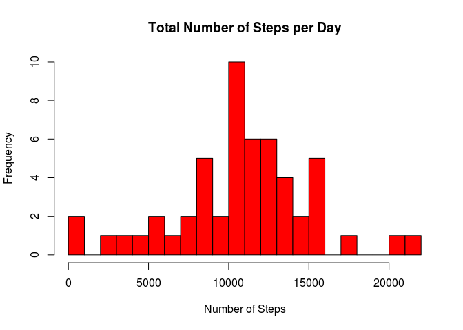
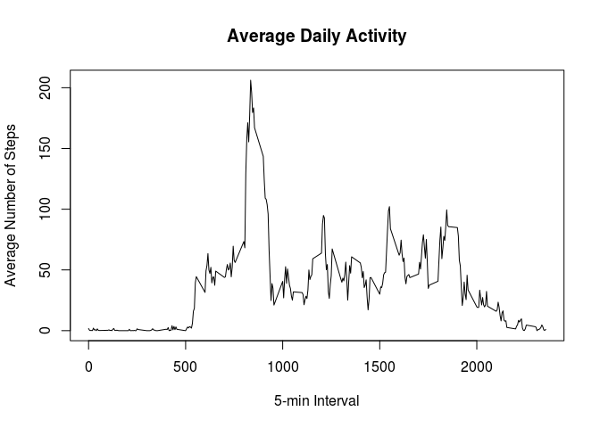
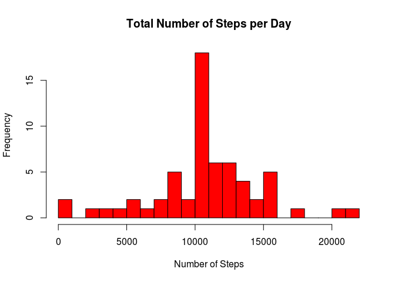
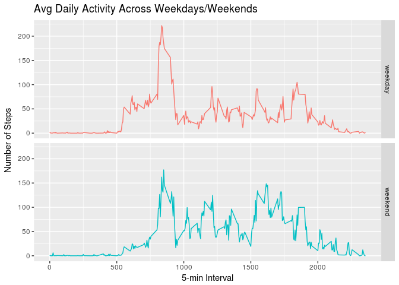

# Reproducible Research: Peer Assessment 1


## Loading and preprocessing the data

Unzip the file archive file, if exist, and load in the data from the CSV file:


```r
zipFile <- "activity.zip"
stopifnot(file.exists(zipFile))
unzip(zipFile)
activity <- read.csv("activity.csv", header = TRUE, stringsAsFactors = FALSE)
str(activity)
```

```
## 'data.frame':	17568 obs. of  3 variables:
##  $ steps   : int  NA NA NA NA NA NA NA NA NA NA ...
##  $ date    : chr  "2012-10-01" "2012-10-01" "2012-10-01" "2012-10-01" ...
##  $ interval: int  0 5 10 15 20 25 30 35 40 45 ...
```

Date column values are strings, transform into proper dates


```r
library(dplyr)
```

```
## 
## Attaching package: 'dplyr'
```

```
## The following objects are masked from 'package:stats':
## 
##     filter, lag
```

```
## The following objects are masked from 'package:base':
## 
##     intersect, setdiff, setequal, union
```

```r
activity <-
  activity %>% mutate(date = as.Date(as.POSIXct(date, format = "%Y-%m-%d")))
```

## What is mean total number of steps taken per day?

Calculate the total number of steps taken per day, ignore the missing values:


```r
tot_steps_per_day <-
  activity %>% 
  na.omit() %>% 
  group_by(date) %>% 
  summarise(tot_steps = sum(steps))
```

Make a histogram of the total number of steps taken each day:

```r
hist(tot_steps_per_day$tot_steps, main = "Total Number of Steps per Day", xlab = "Number of Steps", col = "red", breaks = 30)
```

<!-- -->

Calculate and report the mean and median of the total number of steps taken per day


```r
tot_steps_per_day_summary <- summary(tot_steps_per_day$tot_steps)
tot_steps_per_day_summary
```

```
##    Min. 1st Qu.  Median    Mean 3rd Qu.    Max. 
##      41    8841   10760   10770   13290   21190
```

#### Total Number of Steps per Day (summary):
- **Mean**: 10770
- **Median**: 10760

## What is the average daily activity pattern?

Compute steps per interval averaged across all days:


```r
avg_steps_per_interval <- 
  activity %>% 
  na.omit() %>% 
  group_by(interval) %>% 
  summarise(avg = mean(steps))
```

Make a time series plot of the 5-minute interval (x-axis) and the average number of steps taken, averaged across all days (y-axis)


```r
with(avg_steps_per_interval,
     plot(interval, avg, type="l", main="Average Daily Activity", xlab="5-min Interval", ylab="Average Number of Steps"))
```

<!-- -->

Which 5-minute interval, on average across all the days in the dataset, contains the maximum number of steps?


```r
int_max_num_steps <- avg_steps_per_interval[which.max(avg_steps_per_interval$avg),1]
int_max_num_steps
```

```
## # A tibble: 1 x 1
##   interval
##      <int>
## 1      835
```

The max number of steps interval is 835

## Imputing missing values

Calculate and report the total number of missing values in the dataset (i.e. the total number of rows with NAs)


```r
colSums(is.na(activity))
```

```
##    steps     date interval 
##     2304        0        0
```

There are a total of 2304 rows with missing steps values. There are no missing values for the other variables.

Create a new dataset that is equal to the original dataset but with the missing data filled in. 

**The strategy is to use, for each missing value, the average of the number of steps of the corresponding 5-min interval**. We can use the already computed data frame *avg_steps_per_interval* to support this.


```r
impute_activity <- activity
for (i in which(is.na(impute_activity$steps))) { 
  impute_activity[i,"steps"] <- 
    avg_steps_per_interval[which(avg_steps_per_interval$interval == impute_activity[i,"interval"]),"avg"] 
}
```

Make a histogram of the total number of steps taken each day and calculate and report the mean and median total number of steps taken per day.


```r
tot_steps_per_day <-
  impute_activity %>%
  group_by(date) %>% 
  summarise(tot_steps = sum(steps))

hist(tot_steps_per_day$tot_steps, main = "Total Number of Steps per Day", xlab = "Number of Steps", col = "red", breaks = 30)
```

<!-- -->

```r
tot_steps_per_day_summary <- summary(tot_steps_per_day$tot_steps)
tot_steps_per_day_summary
```

```
##    Min. 1st Qu.  Median    Mean 3rd Qu.    Max. 
##      41    9819   10770   10770   12810   21190
```

#### Total Number of Steps per Day - Missing Data Imputed (summary):
- **Mean**: 10770
- **Median**: 10770

Of these two estimates, only the median differ from the estimates computed ignoring missing values. The mean and median are now the same, meaning that the impact of imputing missing data is to make the empirical distribution more symmetric.
There is an obvious increase in the frequency of values around the centre of the distribution, due to the averaging strategy applied to impute missing values.

## Are there differences in activity patterns between weekdays and weekends?

Create a new factor variable in the dataset with two levels – “weekday” and “weekend” indicating whether a given date is a weekday or weekend day.


```r
impute_activity <-
  impute_activity %>%
  mutate(weekday = factor(if_else(weekdays(impute_activity$date) %in% c("Saturday","Sunday"), "weekend", "weekday")))
```

Make a panel plot containing a time series plot (i.e. type = "l") of the 5-minute interval (x-axis) and the average number of steps taken, averaged across all weekday days or weekend days (y-axis).


```r
library(ggplot2)
qplot(interval, avg, data = impute_activity %>% group_by(interval, weekday) %>% summarise(avg = mean(steps)), facets = weekday ~ ., geom="line", xlab = "5-min Interval", ylab = "Number of Steps", col = weekday) + theme(legend.position="none") + ggtitle("Avg Daily Activity Across Weekdays/Weekends")
```

<!-- -->

During weekdays, there is a tendency towards more activity during the morning which is reduced but more or less steady during the afternoon. During weekends, the tendency is to concentrate activity in the middle of the day and during the afternoon.
